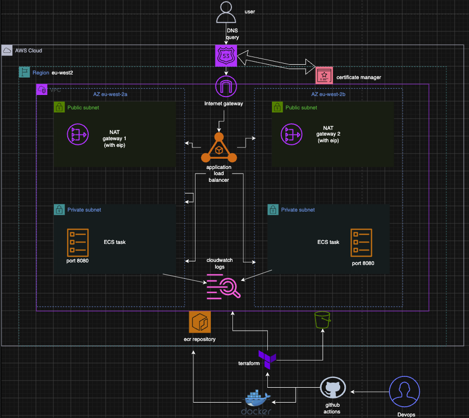
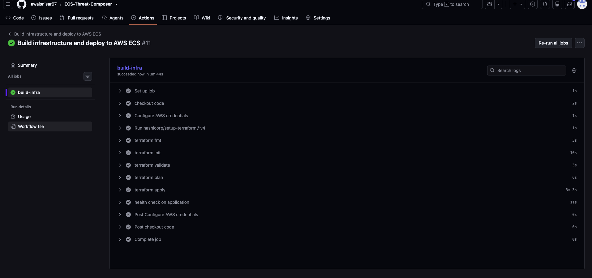
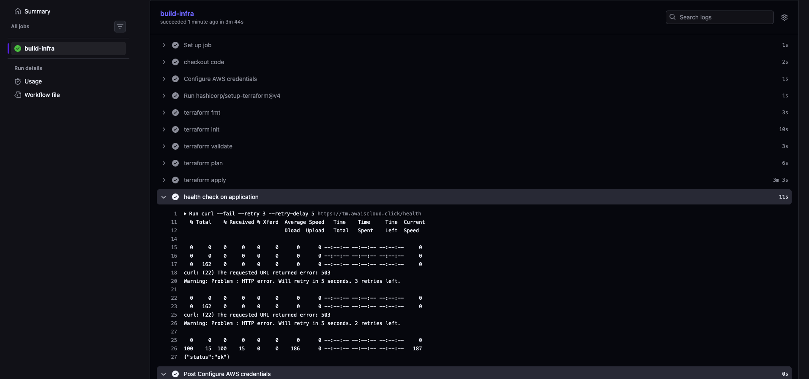
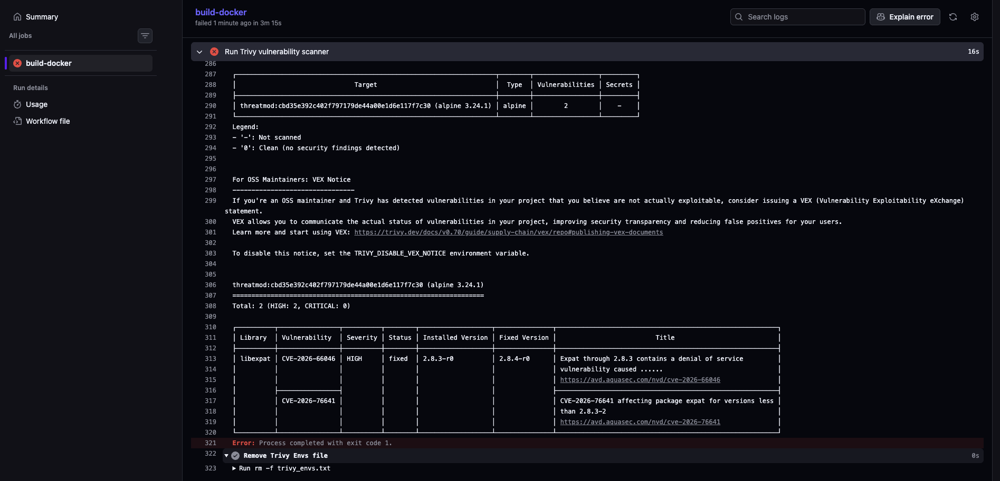

# 

## Overview

This project demonstrates the design, deployment and automation of a multi stage containerised application running on Amazon ECS Fargate.

The objective was to build a production style cloud deployment workflow using Docker to create the multi stage container, terraform to deploy the AWS infrastructure and GitHub Actions to automate the creation of container, push to AWS ECR repository and create the infrastructure needed. The project follows a real world DevOps approach by first understanding the AWS services through manual deployment before recreating the infrastructure using Infrastructure as Code and automating deployments through CI/CD.

The final solution provides a secure and repeatable approach for deploying containerised applications on AWS.

---

# Architecture Overview

The application is hosted on AWS using ECS Fargate with a container image stored in Amazon Elastic Container Registry (ECR).

User traffic flows through Route 53 to an Application Load Balancer secured with HTTPS using an AWS Certificate Manager (ACM) TLS certificate. The ALB forwards requests to the ECS Fargate service running the containerised application.

Infrastructure is provisioned using Terraform and application logs are collected using Amazon CloudWatch.

Architecture components:

- Route 53 for custom domain routing
- Application Load Balancer for traffic distribution
- ACM for HTTPS/TLS certificates
- ECS Fargate for container orchestration
- ECR for container image storage
- VPC and security groups for networking
- CloudWatch for application logging


# Architecture diagram



# Traffic flow

1. The user accesses `https://tm.awaiscloud.click`.
2. Route 53 resolves the custom domain to the Application Load Balancer.
3. The ALB terminates HTTPS using the ACM certificate.
4. The ALB forwards traffic to ECS tasks running in private subnets on port 8080.
5. ECS tasks retrieve the container image from Amazon ECR.
6. Application logs are sent to Amazon CloudWatch.
7. NAT gateways provide outbound internet connectivity for resources in the private subnets.


# Directory structure 

## Directory Structure

```
ECS-Threat-Composer/
│
├── .github/
│   └── workflows/
│       ├── docker-build.yml
│       ├── gitleaks.yml
│       ├── terraform-deploy.yml
│       └── terraform-destroy.yml
│
├── threat-app/
│   ├── Dockerfile
│   └── .dockerignore
│
├── infrastructure/
│   ├── bootstrap/
│   │   ├── main.tf
│   │   ├── provider.tf
│   │   └── .terraform.lock.hcl
│   │
│   ├── modules/
│   │   ├── vpc/
│   │   ├── ecs/
│   │   ├── alb/
│   │   ├── acm/
│   │   └── route53/
│   │
│   ├── main.tf
│   ├── provider.tf
│   ├── variables.tf
│   ├── outputs.tf
│   ├── backend.tf
│   └── .terraform.lock.hcl
│
├── .gitignore
├── README.md
└── Troubleshooting.md
```


# Technology Stack

## Cloud Platform

**Amazon Web Services**

Services used:

- Amazon ECS Fargate
- Amazon Elastic Container Registry (ECR)
- Application Load Balancer
- Amazon VPC with public and private subnets
- NAT gateways and elastic ip addresses
- Route 53
- AWS Certificate Manager (ACM)
- Identity and Access Management (IAM)
- Amazon CloudWatch

---
# Local App Setup 💻
```
yarn install
yarn build
yarn global add serve
serve -s build

Then visit:
http://localhost:3000
```
# Containerisation

## Docker

The application is containerised using Docker.

Features implemented:

- Multi stage Docker builds
- Optimised container image size
- Non root container execution
- Container health checks
- Local container testing before deployment


## Docker Image Optimization

Docker image optimisation: The initial builder image was 1.66 GB. Using a multi stage build with an Nginx only runtime reduced the final production image to 92.15 MB, approximately a 94.6% reduction in image size.


Application health endpoint:

```
GET /health

{
  "status": "ok"
}
```

---

# Infrastructure as Code

## Terraform

Terraform is used to provision and manage AWS infrastructure.

Features implemented:

- Modular Terraform structure
- VPC and networking resources
- ECS cluster and Fargate service
- Application Load Balancer
- ECR repository
- IAM roles and policies
- Security groups
- Route 53 DNS configuration
- ACM certificate management

# Terraform state management:

- Remote Terraform state stored securely in Amazon S3
- S3 state locking using Terraform's native lockfile mechanism
- Encrypted state storage
- Versioning enabled on the S3 state bucket

This provides a reliable and collaborative Infrastructure as Code workflow.

# Terraform bootstrap 

A separate Terraform bootstrap configuration creates resources required before the main infrastructure can be deployed.

The bootstrap configuration manages:

- Amazon S3 bucket for Terraform remote state
- S3 versioning, encryption and state locking
- Amazon ECR repository

The main Terraform configuration then uses the existing ECR repository when creating the ECS infrastructure.

This separates the lifecycle of the resources required to bootstrap Terraform from the main application infrastructure.

---

# CI/CD Automation

## GitHub Actions

The deployment pipeline automates:

- Docker image building
- Image tagging using commit SHA
- Publishing images to Amazon ECR
- Terraform validation
- Terraform deployment
- ECS application updates
- Post deployment health checks
- AWS authentication uses OpenID Connect (OIDC) instead of storing long lived AWS credentials.

# Immutable image deployment 

- Docker images are tagged using the Git commit SHA rather than 'latest'. The same SHA is passed to Terraform so the ECS task definition references the exact image produced by the CI pipeline.

This provides traceability between a Git commit, Docker image and ECS deployment.


# Terraform infrastructure deployment



# Application health check 



# Application accessible over https


---

# Security Features

Implemented security practices:

- HTTPS encryption using ACM TLS certificates
- IAM roles following least privilege principles
- GitHub Actions OIDC authentication
- Restricted access using security groups
- Non root Docker containers
- Separation of application and infrastructure code
- Trivy scan for container vulnerabilities 
- Gitleaks to detect any secrets being pushed 
- ECS tasks deployed in private subnets with no public IP addresses
- ALB to ECS security group restrictions
- Immutable ECR image tags using Git commit SHA

# Container vulnerability found by Trivy 

Trivy was integrated into the Docker CI pipeline to scan container images for HIGH and CRITICAL vulnerabilities.

The initial image scan failed because HIGH severity vulnerabilities were identified in outdated packages. The affected packages were subsequently updated and the image passed the vulnerability scan.



---

# Troubleshooting 

[View Troubleshooting Guide](Troubleshooting.md)


# Lessons Learned

This project provided practical experience with:

- Deploying containerised workloads using ECS Fargate
- Building secure AWS infrastructure using Terraform
- Managing Terraform state in a production style workflow
- Understanding AWS networking, load balancing and IAM
- Testing Terraform deployment and destruction through GitHub Actions
- Understanding infrastructure dependencies and Terraform state boundaries
- Troubleshooting AWS IAM, OIDC, ECR, ECS networking and health checks

- A key learning was the value of building the infrastructure through ClickOps first and then recreating it using Terraform. This helped me understand the purpose of each AWS service, identify dependencies between resources, understand the deployment order, and troubleshoot issues more effectively when converting the architecture into Infrastructure as Code.

---

# Future Improvements

Potential improvements:

- Implement ECS auto scaling
- Add AWS WAF protection
- Add Terraform security scanning
- Introduce blue green deployments
- Add improved monitoring dashboards
- Integrate AWS Secrets Manager for any application secrets
